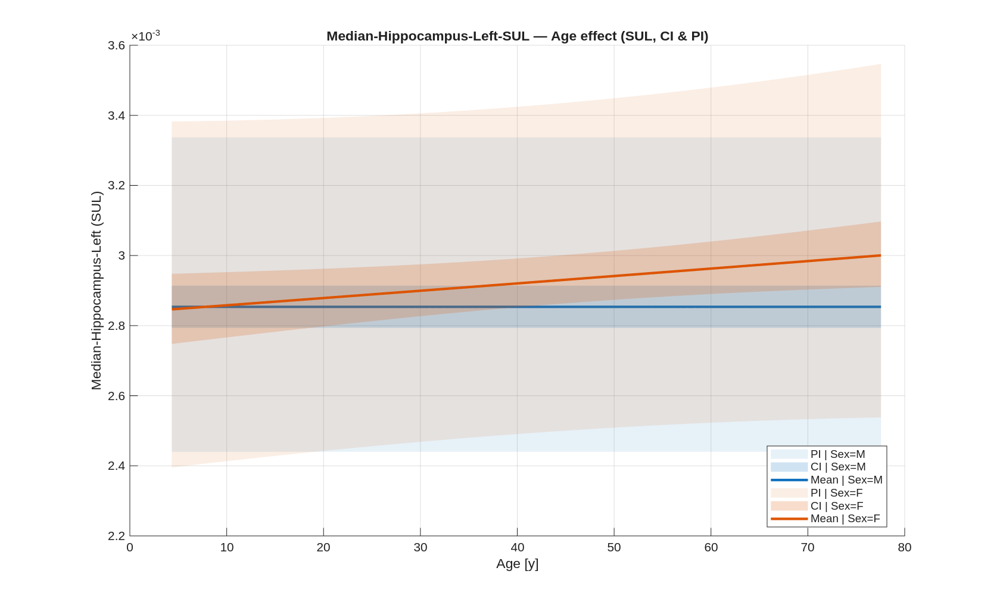
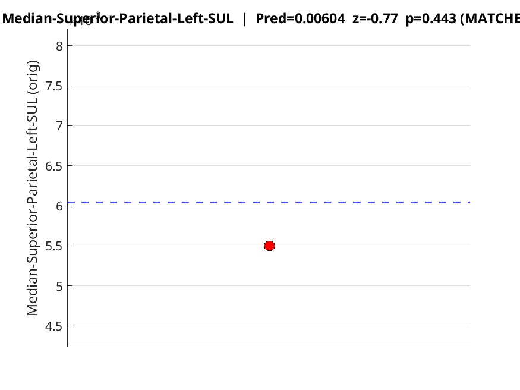
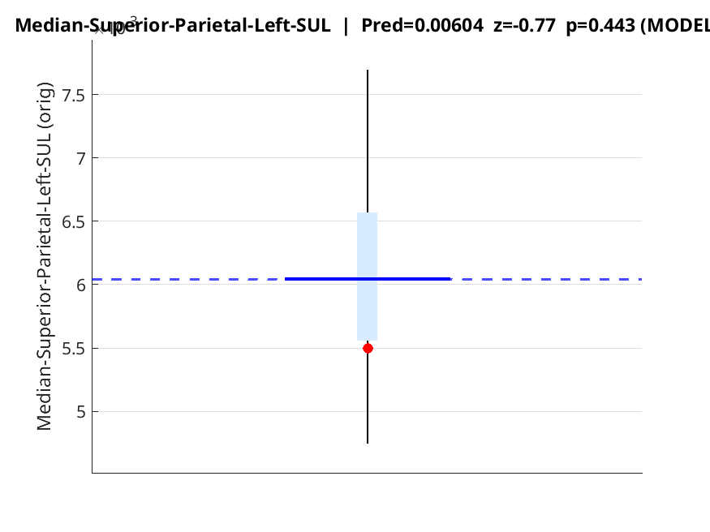
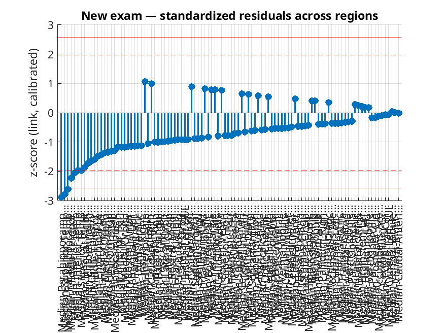

# AZV PET Template

**Normative modelling of FDG-PET brain intensities** from a mixed clinical cohort (≈420 scans).  
The pipeline builds region-wise reference models (with age/sex & acquisition covariates), validates them with LOO cross-validation, calibrates predictions, and then scores new patients with prediction intervals and z-scores.

> ⚠️ Research prototype, **not** a medical device. Use under supervision of qualified clinicians.

---

## Why this exists (TL;DR)

Clinical PET data are messy: different ages, sexes, scanners, protocols… We normalize brain FDG-PETs into a common space, extract robust regional signals, and learn **expected intensity profiles** for healthy-looking brains—even when many scans come from oncology (ORL) or epilepsy. The mixed cohort still yields stable estimates thanks to sample size, robust aggregation (medians), and explicit modelling of covariates that soak up non-neurological variability.

---

## What the pipeline does

1. **Spatial normalization**  
   Each PET is affinely registered to the **MNI ICBM152** MRI template. We store fit quality (to gray-matter mask) via **MMI** and **NCC** metrics and keep them later as model covariates (`MMI_to_MNIGMS`, `NCC_to_MNIGMS`).

2. **Atlas parcellation**  
   Normalized PET is parcellated using **CerebrA** (`mni_icbm152_nlin_sym_09c_CerebrA_nifti`). Atlas parcels are **dilated** until touching neighbours to avoid “holes” and increase robustness. See the included label list (`CerebrA_LabelDetails.csv`) for region names and IDs.

3. **Intensity extraction (robust)**  
   Voxel values **< 5000** are set to **NaN** (hard threshold to suppress extra-cerebral & very low-count voxels). For every parcel we compute **median** and **mean** intensity and build one row per scan with DICOM-derived metadata (patient, injected dose, half-life, timing, scanner details …).

4. **Quantitative normalization (SUL) & variance stabilization (log)**  
   - **SUL** uses lean body mass to correct SUV bias in heavy/light patients:  
     \[
     \mathrm{SUL} = \frac{C_\text{tissue} \, [\mathrm{kBq/ml}] \cdot \mathrm{LBM}\,[\mathrm{kg}]}{D_\text{inj, decay-corrected to acquisition}\,[\mathrm{kBq}]}
     \]
     LBM is computed from patient sex/height/weight (configurable; e.g., James or Janmahasatian). Dose is decay-corrected using the radionuclide half-life and time offset from DICOM.  
   - We then use **`SUL_LOG = log(SUL)`** to reduce heteroskedasticity and improve linear model fit.

5. **Global reference (PCA)**
   From reference regions (brainstem & cerebellum; configurable) we build a subject-wise vector, run PCA across the cohort, and keep **PC1**, standardized to **`GlobalRefPC1_z`**. We persist the PCA projector to apply exactly the same transform to new scans.

6. **Statistical modelling (per region)**
   For each parcel’s **median SUL_LOG** we fit the linear model:
   ```
   AgeR1 + AgeR2 + AgeR3 + AgeR4 + Sex + BMI + lTime + lDose
 + logVoxelVol + logAcqDur_s + HasTOF + HasPSF + Subsets + FilterFWHM_mm
 + MMI_to_MNIGMS + NCC_to_MNIGMS + GlobalRefPC1_z
 + Sex:cAge + lDose:lTime
 + (1 | UNIS)
   ```
   **Definitions**
   - `AgeR1..AgeR4`: **restricted cubic spline** basis of **centered age** (`cAge = Age − mean(Age)`), 4 df (boundary knots ~ min/max, internal knots ~ quartiles).  
   - `Sex`: M/F.  
   - `BMI`: kg/m² (centered).  
   - `lTime`: log time from injection to acquisition start (min).  
   - `lDose`: log **decay-corrected** injected dose.  
   - `logVoxelVol`: log voxel volume.  
   - `logAcqDur_s`: log acquisition duration (s).  
   - `HasTOF`, `HasPSF`: scanner features flags.  
   - `Subsets`, `FilterFWHM_mm`: recon parameters.  
   - `MMI_to_MNIGMS`, `NCC_to_MNIGMS`: similarity of PET↔MNI gray-matter, used as image-quality covariates.  
   - `GlobalRefPC1_z`: PCA-based global reference covariate.  
   - `Sex:cAge`: age–sex interaction.  
   - `lDose:lTime`: dose–time interaction (kinetic confounding).  
   - `(1|UNIS)`: random intercept by **unit/scanner** (or another acquisition grouping), capturing between-unit offsets.

7. **Validation (LOO) & Prediction Intervals**
   - **Leave-One-Out CV**: refit the model N times leaving each case out; predict the held-out case.  
   - **Predictive SD**: we use LOO residuals to estimate dispersion for **prediction intervals (PI)**; CIs of the mean effect are based on model SE.  
   - **Calibration**: we decile-bin predictions and plot observed vs predicted means; an **identity line** indicates perfect calibration. If there’s a consistent slope or intercept bias, we learn a **monotone mapping** (isotonic/linear) and apply it when scoring new scans.  
   - **Outputs per region** include: mean effect vs age (by sex) with CI & PI, partial residuals, LOO Pred-vs-Obs, standardized residuals vs age, and a calibration plot.

---

## What the figures look like

> The examples below are for **Median-Hippocampus-Left-SUL_LOG**.  
> To render the images on GitHub, put the PNGs under `docs/img/` and keep the filenames as below.

### 1) Age effect with CI & PI


**What you see**
- **X-axis:** Age [years]. **Y-axis:** regional **median SUL_LOG** (back-transformed to SUL in the axis label if configured).
- Two solid curves = **sex-specific mean predictions** (`Sex = M` in blue, `Sex = F` in orange).  
  All other covariates are held at their **reference** values (centered means/medians; random effect set to 0).
- **Shaded bands:**  
  - **CI (narrow band):** uncertainty of the **mean** prediction.  
  - **PI (wide band):** expected **range for individual patients** (includes residual variability).

**How to read it**
- Use the **mean curves** to understand the expected age/sex trajectory of the region under “typical” scan settings.
- Use the **PI** for clinical interpretation: a new patient lying **outside the PI** at their age/sex suggests the region is atypical (|z| ≳ 2).  
- The **gap between PI and CI** visualizes how much **inter-individual variability** remains after covariate adjustment.

**Takeaways**
- The model captures **non-linear age effects** (through spline terms) and **sex differences**.  
- A **flat CI** but **wide PI** means the mean trend is certain, yet individuals vary—use z-scores/PI for decisions.

---

### 2) Calibration (10 bins)


**What you see**
- We sort cases by predicted value, split into **10 equal-frequency bins**, and plot **Observed mean** (y) vs **Predicted mean** (x).  
- Dashed line = **perfect calibration** (`y = x`). Blue circles = each bin; blue line = smoothed trend.

**How to read it**
- Points **on** the dashed line → calibrated predictions.  
- **Below** the line → **overprediction** (model predicts higher than observed).  
- **Above** the line → **underprediction**.

**Why it matters**
- Good calibration is crucial for **prediction intervals** and **z-scores** to be trustworthy.  
- If we detect a consistent slope/intercept bias, we apply a **monotone post‑hoc calibration** (e.g., isotonic/linear) used later when scoring new patients.

---

### 3) Partial residuals (age term)
  


**What you see**
- Each dot is the **partial residual** of the region w.r.t. **age**, i.e., data with all other covariates (dose/time, scanner, BMI, etc.) **removed**.  
- The red curve (second panel) is a **smooth fit with 95% band** to visualize **shape** independent of other effects.

**How to read it**
- Check that the **smooth** resembles a sensible, **smoothly varying** function (the spline’s intended shape).  
- Systematic patterns (e.g., sharp bends, waves) may suggest **under/over‑fitting**, missing interactions, or a need to **relocate knots**.

**Takeaways**
- Partial residuals validate that the **age spline** is adequate and not hiding obvious misfit.  
- They also reveal whether residual variance **changes with age** (heteroskedasticity).

---

### 4) Predicted vs Observed (LOO)


**What you see**
- **Leave‑One‑Out (LOO)** predictions (y‑axis) against **observed** values (x‑axis); dashed line is `y = x`.  
- The title shows **R²**, **MAE**, **RMSE** from LOO—not from in‑sample fit.

**How to read it**
- Tight cloud around the diagonal → strong **out‑of‑sample accuracy**.  
- **Systematic tilt** (slope ≠ 1) or **offset** (intercept ≠ 0) → miscalibration; address with the calibration step.  
- Fanning patterns → heteroskedasticity; PI must reflect this (ours uses LOO residuals).

**Takeaways**
- This is the **most honest single‑plot sanity check** of generalization.  
- Always trust LOO metrics over in‑sample R² when judging model utility.

---

### 5) Standardized residuals vs age


**What you see**
- **z = (Obs − Pred) / (c · sd_pred)** on the y‑axis (where `c` is a small calibration factor from LOO).  
- Dashed lines at **±2** and solid at **±3** z‑scores mark common **alert thresholds**.

**How to read it**
- Points should be **centered around 0** with **no age trend**.  
- **Clusters beyond ±2** imply heavier tails or unmodelled structure; review covariates and QC metrics.

**Practical use**
- When scoring new patients, the same z‑score definition is used. Values beyond **±2** are flagged; **±3** are rare/extreme.

---

**Summary of the section – what to remember**
- **Age curves (CI/PI)** tell you *what is typical* vs *what range you should expect for an individual*.
- **Calibration** guarantees that predicted numbers correspond to reality; we correct if needed.
- **Partial residuals** confirm that the **functional form** (spline) is appropriate.
- **Pred vs Obs (LOO)** is your generalization check; prefer it to in‑sample metrics.
- **z vs Age** is an operational QC for **outliers** and **age‑dependent bias** in residuals.

---

## How well do regions model?

Most cortical and subcortical **gray matter regions** show excellent model fit with  
**R² between ~0.97–0.99**, which means the covariates (age spline, sex, dose/time, scanner) explain nearly all variance.

A few examples (from `summary.json`):

- **Amygdala**  
  - Left: R²m = 0.981  
  - Right: R²m = 0.982  
  → Subcortical gray matter structures are captured very well.

- **Caudal Middle Frontal**  
  - Left: R²m = 0.967  
  - Right: R²m = 0.968  
  → Frontal cortical parcels also maintain high explanatory power, slightly lower than limbic regions.

- **Inferior Parietal**  
  - Left: R²m = 0.975  
  - Right: R²m = 0.976  
  → Posterior association cortex is robustly modelled.

- **Hippocampus**  
  - Left: R²m = 0.983  
  - Right: R²m = 0.993  
  → Hippocampal metabolism aligns tightly with the covariate model, especially on the right.

For comparison, some **challenging regions**:

- **Basal forebrain**  
  - Left: R²m = 0.935  
  - Right: R²m = 0.933  
  → Small, hard-to-segment structures are less stable; signal is more affected by partial volume.

- **Optic chiasm**  
  - Left: R²m = 0.952  
  - Right: R²m = 0.941  
  → Very small regions near CSF/air boundaries are harder to model.

- **Pars orbitalis (frontal opercular)**  
  - Left: R²m = 0.966  
  - Right: R²m = 0.941  
  → Right side shows notably lower fit, possibly due to variable coverage or registration issues.

---

**Take-home message:**  
- **Large cortical and limbic gray matter** parcels achieve near-ceiling R².  
- **Small deep nuclei or edge regions** (basal forebrain, optic chiasm) are harder to fit and may show noisier predictions.  
- Ventricle regions, while reaching R² ~0.94–0.96, mainly reflect **residual background uptake** rather than true neuronal signal, so they are less meaningful for interpretation.

---

## Using the template

### Requirements
- MATLAB R2022b+ (tested newer), with Statistics & Machine Learning Toolbox.
- (Optional) 3D Slicer for initial QC; ANTs/FSL if you re-run registrations.
- Input CSV assembled like the example **`test_pet_regions_with_mmi_JOINED_08092025.csv`** (parcel medians/means + DICOM metadata).

### Quick start

```matlab
% 1) Setup paths
>> startup

% 2) Train models on the cohort table
>> train_pipeline

% 3) Score a new patient
>> classify_from_bundle('data/to_test/patient_123.csv', 'reports/new_patients/')
```

---

## Repo layout

```
.
├── matlab/
├── data/
│   ├── raw/
│   ├── cohort/
│   └── to_test/
├── models/
├── reports/
├── docs/img/
└── CerebrA_LabelDetails.csv
```
---
# Classifying a new patient

Once the models are trained, **new PET scans** can be classified against the normative reference.

## Step 1: Prepare the input
- The input table for a new patient must be in the **same format** as the training data  
  (`test_pet_regions_with_mmi_JOINED_*.csv`), including:
  - Region means/medians (after thresholding, parcellation, SUL and log-transform).
  - DICOM metadata (age, sex, BMI, dose, time, scanner settings…).
- **Important:** the **PCA projection** (`GlobalRefPC1_z`) must use the **same loadings** saved during training.  
  Do **not** recompute PCA for new data.

## Step 2: Set covariates
- Continuous covariates (Age, BMI, Dose, Time, Voxel volume, Acquisition duration) are **centered** by the same means as in training.
- Categorical covariates (Sex, HasTOF, HasPSF, scanner site “UNIS”) are matched to the same reference coding.
- If a new patient has a covariate value outside the training range (e.g., higher BMI), the model still extrapolates, but the uncertainty grows.

## Step 3: Predict region-wise values
For each region, the model outputs:
- **Predicted mean** and **confidence interval (CI)**  
- **Prediction interval (PI)** for an individual case  
- **z-score** and two-sided **p-value**  
- Outlier flags (`is_outlier_95`, `is_outlier_99`)

Example JSON result (for *Superior Parietal Left*):
```json
{
  "Pred_orig": 0.0060,
  "CI_orig": [0.0057, 0.0064],
  "PI_orig": [0.0047, 0.0077],
  "z": -0.77,
  "p": 0.443,
  "is_outlier_95": false,
  "is_outlier_99": false
}
```

## Step 4: Visualize region vs. model
Two complementary views are provided:

- **Boxplot (matched controls)**  
    
  Patient value (red) vs. matched controls (age/sex subset).

- **Boxplot (model CI/PI)**  
    
  Patient value (red) vs. model prediction (blue line = mean, light blue band = CI, whiskers = PI).

## Step 5: Summary across regions
The whole brain can be reviewed at once:

- **Waterfall plot of z-scores**  
    
  Regions are ordered by deviation. Dashed lines at ±2 mark the “alert” zone; ±3 are rare/extreme.

- **Tabular summary**  
  Example rows from `new_exam_summary.json`:

  | Region               | Observed | Pred   | z    | p     | Outlier   |
  |----------------------|----------|--------|------|-------|-----------|
  | Parahippocampal R    | 0.00326  | 0.00439| -2.89| 0.0039| **yes (99%)** |
  | Superior Temporal R  | 0.00382  | 0.00503| -2.78| 0.0055| **yes (99%)** |
  | Middle Temporal R    | 0.00398  | 0.00539| -2.23| 0.026 | yes (95%) |

---

## Workflow overview

```
DICOM → Preprocessing (registration, parcellation, thresholding) 
     → Regional table (means/medians + metadata) 
     → Apply stored PCA projection (GlobalRefPC1_z) 
     → Match & center covariates 
     → Predict with trained models 
     → JSON/CSV results + diagnostic figures 
     → Report (per-region + whole-brain summary)
```

---

## Interpretation
- Regions with |z| < 2 fall within expected variation.  
- **z between 2–3** → possible deviation (highlighted at 95% level).  
- **z > 3** → highly atypical (rare under null, flagged at 99%).  
- The summary shows **clusters of deviations** (e.g., bilateral temporal/parahippocampal), which may support clinical hypotheses.

---

**Take-home message:**  
Classification of a new patient uses the **same pipeline** as training, with:
- Consistent preprocessing (SUL, log, atlas parcellation, thresholds).  
- Fixed PCA projection from training.  
- Covariates set and centered identically.  
- Outputs in JSON/CSV, with **per-region z-scores** and a **global waterfall plot** for rapid review.


---

## License
MIT

---
